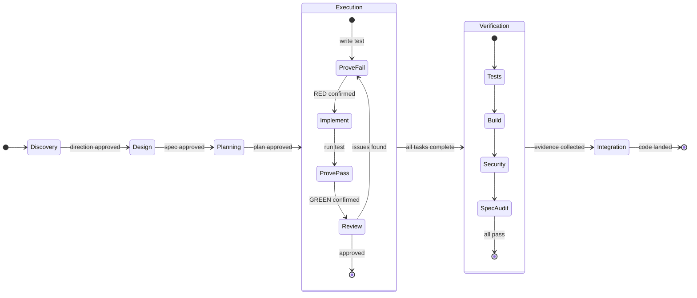

<div align="center">

```
    ███████╗ ██████╗ ██████╗  ██████╗ ███████╗
    ██╔════╝██╔═══██╗██╔══██╗██╔════╝ ██╔════╝
    █████╗  ██║   ██║██████╔╝██║  ███╗█████╗
    ██╔══╝  ██║   ██║██╔══██╗██║   ██║██╔══╝
    ██║     ╚██████╔╝██║  ██║╚██████╔╝███████╗
    ╚═╝      ╚═════╝ ╚═╝  ╚═╝ ╚═════╝ ╚══════╝
```

**Phase-locked development workflow for Claude Code**

Evidence gates. Test-first discipline. No shortcuts.

[]()
[]()
[]()
[]()
[]()

</div>

---

## What Forge Does

Forge treats software construction as a series of earned progressions. Each phase produces demonstrable evidence before the next phase unlocks. The agent cannot skip steps, cut corners, or claim completion without proof.

**Rules are suggestions. Gates are enforcement.** You can write "always test first" in CLAUDE.md, and the agent will agree, then skip it when it feels confident. Forge enforces at two levels: **hooks** intercept tool use at runtime (phase-gate blocks code edits during pre-execution phases; commit-guardian requires passing test evidence before commits), and **skills** provide deeply specified workflow instructions with hard gates, anti-patterns, and evidence requirements that resist rationalization under pressure. Hooks are walls. Skills are the operating manual that makes those walls effective.

## Workflow



Each transition requires evidence. No phase advances on assertions alone.

| Phase | Skill | Gate |
|-------|-------|------|
| **Discovery** | `discover-intent` | User approves direction |
| **Design** | `shape-design` | Spec reviewed and approved |
| **Planning** | `chart-tasks` | All tasks have verification criteria |
| **Execution** | `drive-execution` + `prove-first` | All tasks pass test-first + review |
| **Verification** | `inspect-work` + `confirm-complete` | Tests, build, security, spec coverage |
| **Integration** | `land-changes` | User chooses merge/PR/keep/discard |

## Skill Selection

Forge uses a three-tier routing system instead of blanket invocation rules.

**Tier 1 -- Unconditional.** These apply to all implementation and debugging work. No exceptions.

| Skill | Trigger |
|-------|---------|
| `prove-first` | Any new production code or bugfix |
| `trace-fault` | Any bug, test failure, or unexpected behavior |
| `confirm-complete` | Any claim that work is done |

**Tier 2 -- Intent-matched.** Activate when their description matches the task.

`discover-intent` | `shape-design` | `chart-tasks` | `drive-execution` | `inspect-work` | `land-changes` | `distill-lessons` | `receive-feedback`

**Tier 3 -- User-invoked.** Available via slash invocation, never auto-triggered. All carry `disable-model-invocation: true`.

| Skill | Invocation | Purpose |
|-------|------------|---------|
| `start` | `/forge:start` | Initiate a new workflow |
| `status` | `/forge:status` | Show current phase and progress |
| `advance` | `/forge:advance` | Check gates, advance to next phase |
| `audit` | `/forge:audit` | Run quality, security, and integration audit |
| `isolate-work` | `/forge:isolate-work` | Create an isolated git worktree |

## Install

```bash
# Add the marketplace and install
claude plugins marketplace add caseyrtalbot/forge
claude plugins install forge@caseyrtalbot
```

Or from a local clone:

```bash
git clone https://github.com/caseyrtalbot/forge.git
claude plugins marketplace add ./forge
claude plugins install forge@caseyrtalbot
```

**Restart Claude Code after installing** to load skills, agents, and hooks.

**Requirements:** Claude Code v1.0.33+, Node.js 18+, Git

## Quick Start

```bash
/forge:start "Add user authentication"   # Begin a workflow
/forge:status                             # Check current phase
/forge:advance                            # Advance when gates pass
/forge:audit                              # Run full quality audit
```

After `/forge:start`, the agent enters Discovery: reads project context, asks questions one at a time, refines what to build. Once you approve a direction, it moves through Design (spec), Planning (tasks), Execution (test-first implementation with per-task review), Verification (tests, build, security scan), and Integration (merge/PR). The entire workflow persists across sessions in `.forge/forge-state.json`.

## What's Inside

### 16 Skills

Tiers 1 and 2 are described in the Skill Selection section above. Tier 3 skills (user-invoked) are `start`, `status`, `advance`, `audit`, and `isolate-work`.

| Skill | Phase | Purpose |
|-------|-------|---------|
| `discover-intent` | Discovery | Refine what to build through structured dialogue |
| `shape-design` | Design | Create spec with architecture, data flow, edge cases |
| `chart-tasks` | Planning | Decompose spec into atomic tasks with verification |
| `drive-execution` | Execution | Orchestrate fresh-agent-per-task with status handling |
| `prove-first` | Execution | Test-first discipline with Iron Law enforcement |
| `inspect-work` | Verification | Three-stage review with re-review loops |
| `confirm-complete` | Verification | Evidence-based completion, fresh execution required |
| `land-changes` | Integration | Merge/PR/keep/discard with user consent |
| `trace-fault` | Any | Root cause analysis with architecture escalation |
| `distill-lessons` | Any | Workflow retrospective |
| `receive-feedback` | Any | Code review receiving with pushback framework |
| `isolate-work` | Any (user-invoked) | Git worktree management with safety verification |
| `start` | Any (user-invoked) | Initiate a new workflow |
| `status` | Any (user-invoked) | Show current phase, progress, and pending gates |
| `advance` | Any (user-invoked) | Check gates and advance to next phase |
| `audit` | Verification (user-invoked) | Cross-cutting quality, security, and integration audit |

Every skill includes: HARD-GATE enforcement, dot process flow diagram, anti-patterns section, evidence requirements, and explicit transitions.

### 9 Agents

All agents run on Opus with max effort.

| Agent | Tools | Purpose |
|-------|-------|---------|
| `spec-analyst` | Read, Grep, Glob | Validate specs for completeness and contradictions |
| `task-decomposer` | Read, Grep, Glob | Break specs into independently executable tasks |
| `dependency-mapper` | Read, Grep, Glob | Trace change impact across codebase |
| `implementer` | Read, Write, Edit, Bash, Grep, Glob | Execute single tasks with test-first discipline |
| `test-strategist` | Read, Grep, Glob, Bash | Determine test needs and audit coverage |
| `quality-auditor` | Read, Grep, Glob, Bash | Two-stage review: spec compliance then code quality |
| `security-sentinel` | Read, Grep, Glob, Bash | OWASP-aware vulnerability scanning |
| `integration-verifier` | Read, Bash, Grep, Glob | Full test suite and build verification |
| `doc-synthesizer` | Read, Write, Edit, Grep, Glob | Keep documentation in sync with code |

The `implementer` agent reports structured status: **DONE**, **DONE_WITH_CONCERNS**, **NEEDS_CONTEXT**, or **BLOCKED**. The orchestrator (`drive-execution`) handles each status appropriately, including escalation for persistent blockers.

### 5 Hooks

| Hook | Event | Enforcement |
|------|-------|-------------|
| `session-init` | SessionStart | Load workflow state, display phase status |
| `phase-gate` | PreToolUse (Write/Edit) | Block code edits during discovery/design/planning |
| `evidence-collector` | PostToolUse (Bash) | Capture test and build output as evidence |
| `commit-guardian` | PreToolUse (Bash) | Require fresh test evidence before git commits (blocks stale evidence during execution) |
| `session-capture` | SessionEnd | Persist state for cross-session continuity |

## Key Concepts

### Evidence Gates

Every phase transition requires proof. "Tests pass" requires terminal output showing pass counts. "Build succeeds" requires build output with exit code 0. "I checked and it looks fine" is not evidence.

### The Iron Law

No production code without a failing test first. Exceptions: configuration files, type definitions, static assets. Everything else gets a test. Code written before the test gets deleted. See `skills/prove-first/rationalization-table.md` for the 15 most common excuses and their rebuttals.

### Re-Review Loops

When `inspect-work` finds issues, the implementer fixes them and the reviewer re-reviews. Not optional. Spec compliance must pass before code quality review begins. Maximum 3 loops per stage before escalating to the user.

### Architecture Escalation

After 3 failed fix attempts on the same bug, `trace-fault` stops attempting fixes and questions the architecture. Is the abstraction wrong? Is the data model forcing a workaround? This prevents infinite cycles of symptom treatment.

### Receive and Push Back

`receive-feedback` requires verifying review suggestions against the actual codebase before implementing. Performative agreement ("You're absolutely right!") is forbidden. If a suggestion is wrong, push back with evidence.

## Hook Profiles

Control hook strictness via environment variable:

```bash
export FORGE_HOOK_PROFILE=minimal    # Only session lifecycle
export FORGE_HOOK_PROFILE=standard   # All hooks (default)

export FORGE_DISABLED_HOOKS=phase-gate,commit-guardian  # Disable specific hooks
```

## File Conventions

| Artifact | Location |
|----------|----------|
| Specs | `docs/forge/specs/YYYY-MM-DD-<topic>-design.md` |
| Plans | `docs/forge/plans/YYYY-MM-DD-<topic>-plan.md` |
| Evidence | `.forge/evidence/<phase>/<artifact>` |
| State | `.forge/forge-state.json` |

## Platform Support

| Platform | Level | Notes |
|----------|-------|-------|
| **Claude Code** | Full | Primary target, all features |
| **Codex CLI** | Partial | Agents via AGENTS.md |
| **Gemini CLI** | Partial | Extension manifest |

## Philosophy

- **Earned Progression** -- every phase transition requires evidence
- **Transparent State** -- workflow progress is always visible
- **Scope Discipline** -- nothing extraneous, nothing skipped
- **Depth Over Breadth** -- 13 deep skills, not 100 shallow ones
- **Verification Is Not Optional** -- evidence before assertions, always
- **Discipline Resists Rationalization** -- skills are pressure-tested to resist excuses
- **Own Your Tools** -- fork it, modify it, make it yours

## Contributing

See [CONTRIBUTING.md](CONTRIBUTING.md) for details on adding skills, agents, hooks, and commands.

## License

MIT
