# Forge Skill Architecture

## Frontmatter Schema

Every Forge skill uses this YAML frontmatter:

```yaml
---
name: <kebab-case-identifier>       # Must match directory name
description: "<trigger text>"        # When to activate this skill
phase: <discovery|design|planning|execution|verification|integration|any>
transitions:                         # What skills come next
  - target: <skill-name>
    condition: "<when this transition fires>"
gates:                               # Evidence required before progression
  entry: "<what must be true to start>"
  exit: "<what must be true to finish>"
---
```

## Skill Body Structure

Every skill body follows this template:

1. **Title** (H1)
2. **Purpose** -- one paragraph explaining what this skill does and why
3. **Hard Gates** -- `<HARD-GATE>` tagged blocks that absolutely prevent progression
4. **Process Flow** -- graphviz dot diagram showing the skill's state machine
5. **Checklist** -- ordered steps that must be completed
6. **Anti-Patterns** -- explicit documentation of what NOT to do
7. **Evidence Requirements** -- what output/artifacts constitute proof of completion
8. **Transition** -- what skill comes next and under what conditions

## Skill Categories

| Category | Skills | Phase |
|----------|--------|-------|
| Discovery | discover-intent | discovery |
| Design | shape-design | design |
| Planning | chart-tasks | planning |
| Execution | drive-execution, prove-first | execution |
| Quality | inspect-work, confirm-complete | verification |
| Integration | land-changes | integration |
| Diagnostic | trace-fault | any |
| Reflection | distill-lessons | any |

## Workflow Graph

```dot
digraph forge_workflow {
    rankdir=LR;
    node [shape=box];

    "discover-intent" -> "shape-design" [label="user approves direction"];
    "shape-design" -> "chart-tasks" [label="user approves spec"];
    "chart-tasks" -> "drive-execution" [label="plan complete"];
    "drive-execution" -> "prove-first" [label="per task"];
    "prove-first" -> "inspect-work" [label="task implemented"];
    "inspect-work" -> "drive-execution" [label="review passes, next task"];
    "inspect-work" -> "prove-first" [label="review fails, fix"];
    "drive-execution" -> "confirm-complete" [label="all tasks done"];
    "confirm-complete" -> "land-changes" [label="verification passes"];
    "confirm-complete" -> "drive-execution" [label="verification fails"];
    "land-changes" -> "distill-lessons" [label="code integrated"];

    "trace-fault" [shape=diamond, label="trace-fault\n(invokable from any phase)"];
}
```


