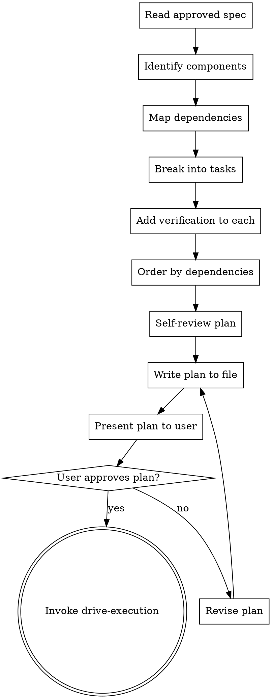

# Chart Tasks

Decompose an approved spec into an ordered list of small, independently executable tasks. Each task must be specific enough that an agent with no project context can execute it, and must include verification criteria so completion is provable.

<HARD-GATE>
Every task in the plan MUST have:
1. A clear description of what to do (not vague like "implement the feature")
2. Specific file paths that will be created or modified
3. Verification criteria (how to prove the task is done -- a test command, a build check, etc.)
4. No placeholders. Every step must include complete code or commands. See `placeholder-rules.md` for forbidden patterns.
A plan with any task missing verification criteria is not complete and cannot be executed.
</HARD-GATE>

## Process Flow



## Checklist

1. **Read the approved spec** thoroughly. Understand every requirement, constraint, and edge case.
2. **Deploy the task-decomposer agent** to analyze the spec and produce an initial task breakdown. Review the agent's output and refine as needed.
3. **Identify components** -- what distinct pieces of work exist? Group by module, layer, or feature area.
4. **Map dependencies** -- which components depend on which? What must be built first?
5. **Break into tasks** -- each task should be completable in 2-5 minutes as a single atomic action by a focused agent. If a task feels like it would take longer, break it further. Each TDD sequence is 5 separate steps: write test, run test (RED), write implementation, run test (GREEN), commit. Each task includes:
   - Task number and title
   - Description (specific enough for an agent with no context)
   - File paths to create or modify
   - Dependencies (which tasks must complete first)
   - Verification command or criteria
6. **Identify parallel opportunities** -- which tasks are independent and can run concurrently?
7. **Self-review the plan** checking:
   - Does every spec requirement map to at least one task?
   - Does every task have verification criteria?
   - Are dependencies correctly ordered (no circular dependencies)?
   - Are types, method signatures, and names consistent across tasks?
   - Placeholder scan: search the plan for TBD, TODO, 'similar to', 'see the spec', 'add appropriate'. Fix all instances.
8. **Write plan to file** at `docs/forge/plans/YYYY-MM-DD-<topic>-plan.md`
9. **Present the plan to the user** for review. Summarize: total tasks, dependency order, estimated parallelism, and any assumptions made during decomposition. The plan is the contract for what gets built. Do not proceed without explicit user approval.
10. **If the user requests changes**, revise the plan and present again. Repeat until approved.

## Task Template

```markdown
### Task N: [Title]

**Description**: [What to do, specifically]
**Files**: [Paths to create/modify]
**Depends on**: [Task numbers, or "none"]
**Parallel**: [Can run with tasks X, Y]
**Verification**: [Command to run or condition to check]
```

## Anti-Patterns

**"This task is: implement the authentication system"**
Too large. Break it down. "Create the User model with email and hashed_password fields" is a task. "Implement authentication" is a project.

**"Verification: it works"**
Not a criterion. "Run `npm test -- --grep auth` and all tests pass" is verification. "It works" is a wish.

**"I'll figure out the order during execution"**
Dependencies discovered during execution cause rework. Map them now when the cost of changing course is zero.

## Evidence Requirements

- Plan file exists at the documented path
- Every task has a description, file paths, and verification criteria
- Self-review confirms no spec requirements are missed
- User has reviewed and approved the plan

## Transition

When the plan is complete and the user has approved it, invoke **drive-execution** to begin task implementation.
