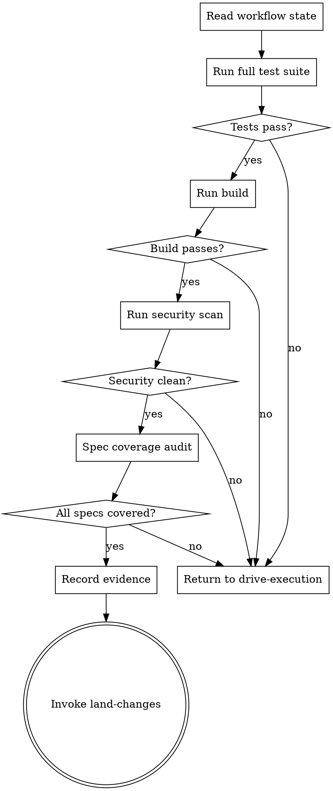

# Confirm Complete

Verify that the entire body of work is complete, correct, and ready to integrate. This is the final checkpoint before code lands. Every claim of completion must be backed by executed evidence, not assertions.

<HARD-GATE>
"I wrote it correctly" is NOT evidence.
"The tests should pass" is NOT evidence.
"I checked and it looks fine" is NOT evidence.

Evidence is OUTPUT. Run the command. Capture the result. Show the result. Only then can you claim completion.

Do NOT output any completion claim, success message, or "all done" statement until you have run verification commands and can show their output.
</HARD-GATE>

## Process Flow

## Verification Checks

### 1. Full Test Suite
Deploy the **integration-verifier** agent to run the project's complete test suite (not just the tests for changed files). Capture the output. All tests must pass.

### 2. Test Coverage Audit
Deploy the **test-strategist** agent to audit test coverage. Verify that all spec requirements have corresponding tests and that no critical paths are untested.

### 3. Build Check
Run the project's build command. Capture the output. Build must succeed with no errors. Warnings should be noted but do not block.

### 4. Security Scan
Deploy the **security-sentinel** agent to scan the diff for:
- OWASP Top 10 vulnerabilities
- Hardcoded secrets
- Unsafe input handling
- Missing authentication/authorization checks

### 5. Spec Coverage Audit
Read the original spec document. For each requirement, verify there is:
- At least one implemented task addressing it
- At least one test verifying it
- No requirement left unaddressed

## Evidence Recording

Write verification results to `.forge/evidence/verification/`:
- `test-results.txt` -- full test suite output
- `build-results.txt` -- build command output
- `security-scan.md` -- security sentinel findings
- `spec-coverage.md` -- requirement-to-task mapping with verification status

## Anti-Patterns

**"All tests pass" (without showing output)**
Show the output. "All tests pass" is a claim. The terminal output showing "47 tests passed, 0 failed" is evidence.

**"I ran the build in my head"**
Run it for real. Mental execution misses environment issues, missing dependencies, and configuration problems.

**"Security is probably fine, it's an internal tool"**
Internal tools get promoted to external tools. Vulnerabilities in internal tools become vulnerabilities in external tools. Scan it.

## Evidence Requirements

- Test suite output captured and all pass
- Build output captured and succeeds
- Security scan report with no critical findings
- Spec coverage audit shows all requirements addressed

## Transition

If all checks pass: invoke **land-changes** to integrate the code.
If any check fails: return to **drive-execution** to remediate.
