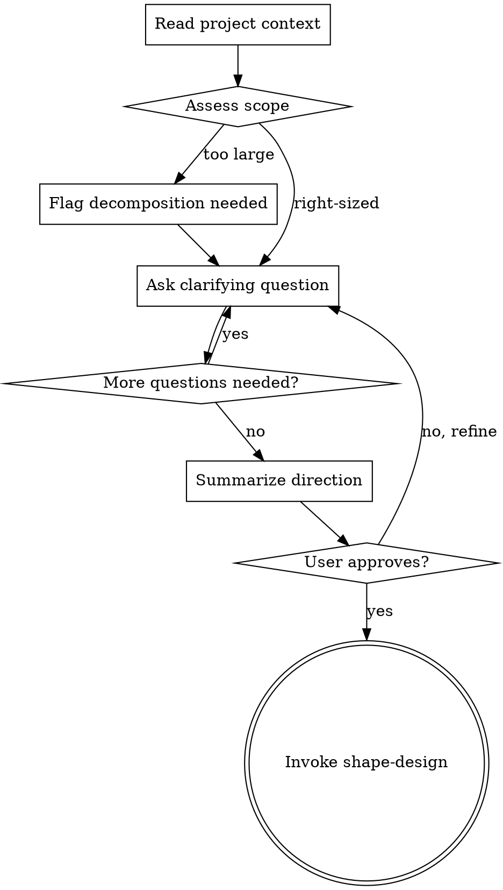

# Discover Intent

Collaboratively refine a rough idea into a clear direction through structured dialogue. This skill asks questions one at a time, explores alternatives, surfaces constraints, and arrives at a shared understanding of what to build and why.

<HARD-GATE>
Do NOT begin any design work, write any spec, create any architecture document, or invoke the shape-design skill until the user has explicitly approved the direction. "Sounds good" or "let's go with that" count as approval. Silence or ambiguity does not.
</HARD-GATE>

## Process Flow

## Checklist

Complete these steps in order:

1. **Read project context** -- check existing files, docs, recent git history to understand the current state
   - If the work involves visual or spatial decisions (UI layout, component structure, data flow diagrams), offer to generate a visual companion to support the conversation.
2. **Assess scope** -- if the request describes multiple independent systems, flag immediately. Help decompose before refining details. Each sub-project gets its own discovery > design > plan > execute cycle.
3. **Ask clarifying questions** -- one question per message. Prefer multiple choice when possible. Focus on:
   - What problem does this solve? Who benefits?
   - What are the boundaries? What is explicitly NOT in scope?
   - What does success look like? How will you know it works?
   - Are there existing patterns in the codebase to follow or avoid?
   - What constraints exist (performance, compatibility, timeline)?
4. **Summarize the direction** -- present a concise summary of:
   - The problem being solved
   - The approach being taken
   - What is in scope and what is not
   - Key constraints and success criteria
5. **Get explicit approval** -- ask the user to confirm the direction before proceeding

## Anti-Patterns

**"Let me just start coding, it's obvious"**
Nothing is obvious. The gap between what the user said and what they meant is where wasted work lives. Even a 30-second discovery conversation catches misalignment.

**"I'll ask all my questions at once"**
Batched questions get batched (shallow) answers. One question at a time lets each answer inform the next question. The conversation is the discovery mechanism.

**"The user seems impatient, I'll skip ahead"**
Impatience is not approval. A rushed discovery phase creates a rushed design phase creates rework in execution. Hold the line.

**"Text-only discovery for visual work"**
Text-only discovery for UI features misses layout, spacing, and flow concerns. When the work is visual, offer a diagram or mockup to surface spatial issues that text alone misses.

## Evidence Requirements

- The user has explicitly approved the direction (their approval message is the evidence)
- A clear problem statement, approach, scope boundary, and success criteria exist in the conversation

## Transition

When the user approves the direction, invoke the **shape-design** skill to create a spec document.
