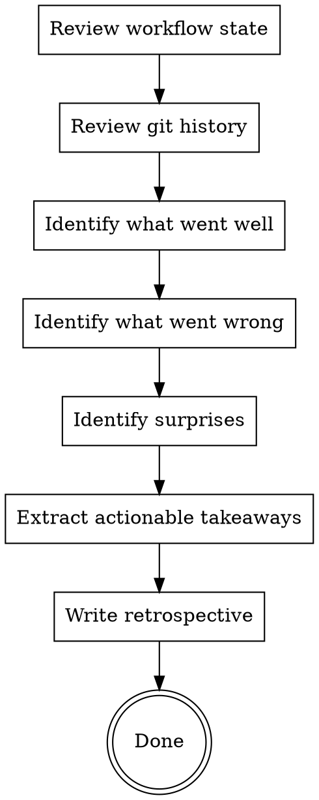

# Distill Lessons

Reflect on completed work to extract reusable insights. This is not a status report. It is an honest assessment of what the process revealed, what surprised you, and what should change for next time.

<HARD-GATE>
Do NOT skip the retrospective. "We're done, let's move on" is not an acceptable reason to skip reflection. Every completed workflow gets a retrospective, even if the work was small. The retrospective must contain at least one entry in each section (went well, went wrong, surprises, takeaways). Generic entries like "everything was fine" do not satisfy this gate.
</HARD-GATE>

## Process Flow



## Checklist

1. **Review the workflow** -- read `.forge/forge-state.json`, the spec, the plan, and verification evidence
2. **Review git history** -- look at the commits, the timeline, and what was reworked
3. **Answer these questions honestly**:
   - What went well? What parts of the process produced good results efficiently?
   - What went wrong? Where did rework happen? What was harder than expected?
   - What was surprising? What assumptions turned out to be wrong?
   - What would you do differently? Specific, actionable changes for next time.
4. **Write a brief retrospective** (not a novel) to `.forge/evidence/retrospective.md`:

```markdown
# Retrospective: [Feature Name]
**Date**: YYYY-MM-DD

## What Went Well
- [Specific observation]

## What Went Wrong
- [Specific observation + what caused it]

## Surprises
- [What we didn't expect + what it taught us]

## Actionable Takeaways
- [Specific change for next time]
```

## Anti-Patterns

**"Everything went great"**
If everything went perfectly, you are not looking hard enough. Every project has friction. Finding it is the point.

**"We should have planned better"**
Too vague. What specifically was missing from the plan? Which task was underspecified? What question should the discovery phase have asked?

**"This was a waste of time"**
The retrospective takes 5 minutes and prevents repeating mistakes across future workflows. The waste is not reflecting.

## Evidence Requirements

- Retrospective document exists at `.forge/evidence/retrospective.md`
- Contains at least one entry in each section (went well, went wrong, surprises, takeaways)
- Takeaways are specific and actionable (not "be better at planning")

## Transition

This is the terminal skill. The Forge workflow is complete.
