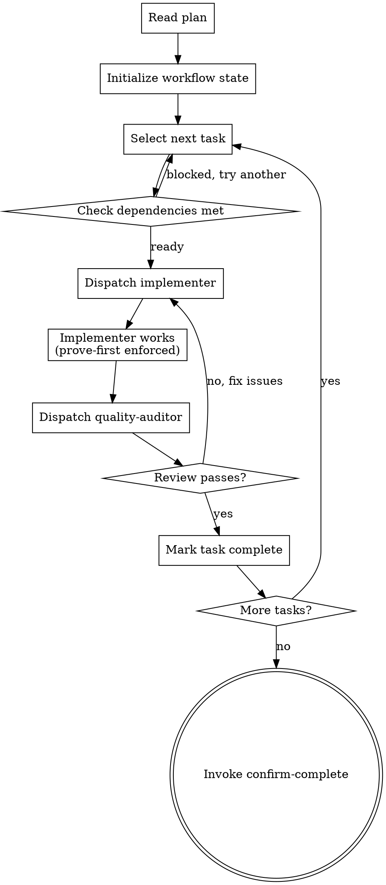

# Drive Execution

Orchestrate the implementation of a plan by dispatching subagents for each task, enforcing test-first discipline, and reviewing completed work before advancing. This skill is the execution coordinator -- it does not write code itself.

<HARD-GATE>
Do NOT implement tasks in the orchestrating context. Dispatch a fresh subagent (implementer agent) for each task. The orchestrator's job is coordination, not implementation. This separation prevents context pollution and ensures each task gets focused attention.
</HARD-GATE>

## Process Flow



## Checklist

1. **Read the plan document** and understand all tasks, their order, and dependencies
2. **Deploy the dependency-mapper agent** to trace the impact of planned changes across the codebase. Use the impact analysis to anticipate side effects before implementation begins.
3. **Initialize workflow state** -- update `.forge/forge-state.json` with current phase, total tasks, and task statuses
4. **For each task (in dependency order)**:
   a. Verify all dependency tasks are complete
   b. Prepare task context: task description, relevant spec sections, file paths, verification criteria
   c. Dispatch a fresh **implementer** subagent with the task context
   d. The implementer follows **prove-first** discipline (test before code)
   e. When the implementer finishes, dispatch the **quality-auditor** agent to review
   f. If review raises concerns, dispatch the implementer again with the feedback
   g. When review passes, mark the task complete in workflow state
   h. Run the task's verification command to confirm
5. **Identify parallel opportunities** -- if independent tasks exist, dispatch multiple implementers concurrently. Each parallel agent gets its own complete context (do not assume shared knowledge between agents). After parallel tasks complete, run a cross-task consistency check before proceeding.
6. **Update progress** after each task -- track completed/total in `.forge/forge-state.json`
7. **When all tasks complete**, invoke **confirm-complete** for end-to-end verification

## Implementer Status Handling

When the implementer reports back, handle based on status:

| Status | Meaning | Action |
|--------|---------|--------|
| **DONE** | Task complete, tests pass | Dispatch quality-auditor for review |
| **DONE_WITH_CONCERNS** | Complete but has concerns | Review concerns, dispatch quality-auditor, note for distill-lessons |
| **NEEDS_CONTEXT** | Missing information | Provide context from spec/plan, re-dispatch same task |
| **BLOCKED** | Cannot proceed | Investigate blocker, update plan if needed, escalate to user if persistent |

## Subagent Context Template

When dispatching an implementer, provide exactly this context:

```
Task: [task number and title]
Description: [from plan]
Files to modify: [from plan]
Verification: [from plan]

Relevant spec sections:
[paste relevant sections from the design spec]

Constraints:
- Write tests BEFORE implementation code (prove-first discipline)
- Run verification command when done
- Commit working code with a descriptive message
```

## Anti-Patterns

**"I'll implement this task myself instead of dispatching"**
The orchestrator must not implement. Mixing coordination and implementation pollutes the orchestrator's context and creates blind spots in review.

**"Let me batch all tasks and review at the end"**
Review after every task, not after all tasks. Catching a design flaw in task 2 is cheap. Catching it after task 8 is expensive.

**"The implementer is stuck, I'll take over"**
If the implementer is stuck, the task description is probably unclear. Improve the task description and re-dispatch. Taking over defeats the isolation benefit.

## Evidence Requirements

- `.forge/forge-state.json` shows all tasks with status "complete"
- Each task's verification command has been run and passed
- Quality-auditor has reviewed each task

## Transition

When all tasks are complete and individually verified, invoke **confirm-complete** for end-to-end verification.
