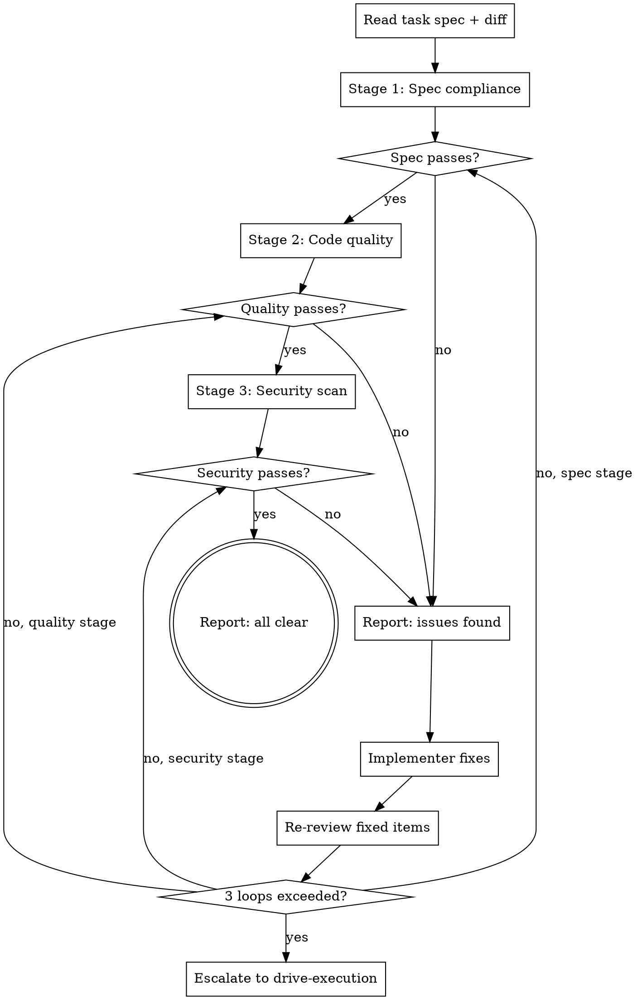

# Inspect Work

Review completed task implementation across three dimensions: does it match the spec, is the code well-written, and is it secure? This is a structured review, not a rubber stamp.

<HARD-GATE>
Review is not optional and cannot be skipped for "simple" tasks. Every implemented task gets reviewed before being marked complete. The review must cover all three dimensions. Passing on code quality does not excuse a spec compliance failure.
</HARD-GATE>

## Process Flow

## Three-Stage Review

### Stage 1: Spec Compliance
- Does the implementation match what was planned?
- Are all requirements from the task description addressed?
- Are there additions not in the spec (scope creep)?
- Do types, method names, and interfaces match what was designed?

### Stage 2: Code Quality
- Is the code readable and well-structured?
- Are functions focused (single responsibility)?
- Is error handling present and appropriate?
- Are there code smells (duplication, deep nesting, magic values)?
- Do tests actually test meaningful behavior (not just coverage)?

### Stage 3: Security
- Is user input validated and sanitized?
- Are SQL queries parameterized?
- Are secrets kept out of code?
- Are authentication/authorization checks present where needed?
- Are error messages safe (no internal details leaked)?

## Re-Review Loop

When a review stage finds issues, the implementer fixes them and the reviewer re-reviews. This is not optional.

1. Reviewer reports issues with severity (Critical / Important / Suggestion)
2. Critical: implementer MUST fix. Important: implementer SHOULD fix (can defer with written rationale). Suggestions: noted, no action required.
3. After fixes: reviewer re-reviews ONLY the fixed items (not a full re-review)
4. Loop repeats until no critical issues remain and all important items are fixed or acknowledged
5. Maximum 3 loops per stage. After 3, escalate to drive-execution for human input.

For reviewer prompt templates, see `reviewer-prompts.md`. For the full protocol, see `re-review-protocol.md`.

## Issue Severity

Categorize every finding:

| Severity | Definition | Action |
|----------|-----------|--------|
| **Critical** | Breaks functionality, security vulnerability, data loss risk | Must fix before proceeding |
| **Important** | Code smell, missing edge case, suboptimal pattern | Should fix, can proceed if acknowledged |
| **Suggestion** | Style preference, minor optimization, documentation gap | Note for future, proceed |

## Anti-Patterns

**"Looks good to me"**
A review with no findings is suspicious. Every piece of code has something worth noting, even if it is a suggestion. If you found nothing, you did not look hard enough.

**"I'll just review the final result at the end"**
Review per task, not per project. Issues compound. A wrong abstraction in task 2 infects tasks 3 through 8.

**"The tests pass so the code is correct"**
Tests verify behavior, not quality. Passing tests with SQL injection vulnerabilities still pass tests.

## Evidence Requirements

- Review report exists with findings categorized by severity
- All critical issues are resolved before the task is marked complete
- The review explicitly covers all three stages

## Transition

If all stages pass (no critical issues): return to **drive-execution** to proceed with the next task.
If critical issues found: return to **prove-first** for the implementer to fix.
