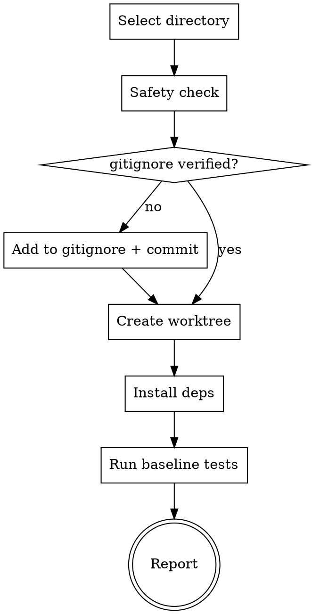

# Isolate Work

Create an isolated git worktree for feature work so the main working directory stays clean. User-invoked only: do not auto-trigger this skill.

## Directory Selection Priority

1. **Existing directory**: check for `.worktrees/` or `worktrees/` in the project root. If both exist, `.worktrees/` wins.
2. **CLAUDE.md preference**: check for a worktree directory preference in the project's CLAUDE.md.
3. **Ask user**: offer two choices:
   - `.worktrees/` in the project root (local, hidden)
   - `~/.config/forge/worktrees/<project-name>/` (global location)

<HARD-GATE>
For project-local worktree directories (.worktrees or worktrees), verify the directory is in .gitignore BEFORE creating the worktree.

Check: `git check-ignore -q <directory> 2>/dev/null`

If NOT ignored:
1. Add the directory to .gitignore
2. Commit the .gitignore change
3. THEN proceed with worktree creation

One missed check means worktree contents committed to the repository. No exceptions.
</HARD-GATE>

## Process Flow



## Creation Steps

1. **Create the worktree** with a new branch:
   ```bash
   git worktree add <dir>/<branch-name> -b <branch-name>
   ```
   Branch naming: `forge/<feature-name>` by default, or user-specified.

2. **Auto-detect project setup** and install dependencies:
   - `package.json` found: `npm install` (or `yarn install` if yarn.lock present)
   - `Cargo.toml` found: `cargo build`
   - `pyproject.toml` found: `poetry install`
   - `go.mod` found: `go mod download`
   - Nothing found: skip dependency install

3. **Run baseline tests** using the project's test command. This establishes a known-good state. If tests fail, report the failures and ask whether to proceed.

4. **Report**: worktree path, branch name, baseline test results.

## Anti-Patterns

**"Skip the gitignore check"**
One missed check means worktree contents committed to the repo. The HARD-GATE exists for a reason.

**"Skip baseline tests"**
Without a known-good baseline, you cannot distinguish new regressions from pre-existing failures.

**"Hardcode setup commands"**
Auto-detect from project manifest files. Different projects use different tools.

**"Assume the directory location"**
Follow the priority: existing directory, then CLAUDE.md, then ask the user. Consistency matters.

## Evidence Requirements

- Worktree directory is in `.gitignore` (verified with `git check-ignore`)
- Baseline tests pass in the new worktree
- Worktree path and branch name reported to user

## Cleanup

Handled by **land-changes**. When the user chooses merge, PR, keep, or discard, `land-changes` runs `git worktree remove` as part of workspace cleanup.
