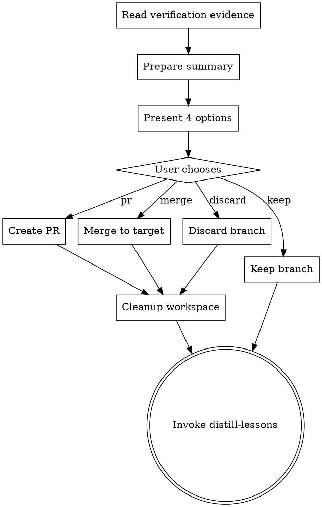

# Land Changes

Integrate verified code into the target branch. Present the user with clear options, execute their choice, and clean up the workspace.

<HARD-GATE>
Do NOT merge, push, or create a PR without explicit user consent. Always present options and wait for the user to choose. An automated merge to the target branch without user approval is an irreversible action. The user decides how code lands, always.
</HARD-GATE>

## Process Flow

## Checklist

1. **Read verification evidence** from `.forge/evidence/verification/` to confirm all checks passed
2. **Prepare a change summary** including:
   - What was built (from the spec)
   - Tasks completed (from the plan)
   - Test results (from verification)
   - Files changed (from git diff)
3. **Deploy the doc-synthesizer agent** to update any existing documentation that references changed code. Review the agent's output before committing doc updates.
4. **Present four options** to the user:

   **Option 1: Merge** -- merge the branch directly into the target branch
   **Option 2: PR** -- create a pull request for team review
   **Option 3: Keep** -- leave the branch as-is for later
   **Option 4: Discard** -- delete the branch and all changes

4. **Execute the user's choice**:
   - **Merge**: `git checkout <target> && git merge <branch>`, then delete the feature branch
   - **PR**: `git push -u origin <branch>`, then create PR with summary as description
   - **Keep**: do nothing, inform user the branch is preserved
   - **Discard**: `git checkout <target>`, delete the branch
5. **Clean up workspace** -- if a worktree was used, remove it. Update `.forge/forge-state.json` to mark workflow complete.

## Anti-Patterns

**"Let me just merge without asking"**
The user decides how code lands. Always present options. A merge to main without consent is an incident.

**"The PR description can be short"**
The PR description should tell the reviewer everything they need to know without reading the code. Include the summary, test results, and verification evidence.

**"Cleanup can wait"**
Orphaned branches and worktrees accumulate. Clean up immediately after integration.

## Evidence Requirements

- User explicitly chose an integration method
- If merge: target branch contains the changes
- If PR: PR URL exists and is accessible
- Workspace cleaned up (no orphaned branches or worktrees)

## Transition

After integration, invoke **distill-lessons** for session reflection.
