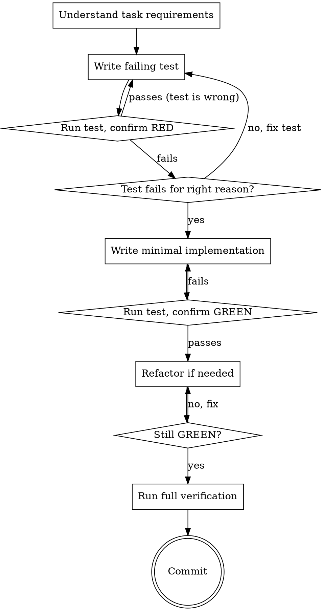

# Prove First

Write the test before writing the code. Watch the test fail. Write the minimal code to make it pass. Verify. Commit. This is not a suggestion. This is the discipline that separates working code from code that happens to work right now.

<HARD-GATE>
NO implementation code without a failing test first.

Wrote code before the test? Delete it. Do not keep it as "reference." Do not "adapt" it. Do not look at it while writing the test. Delete means delete. Start with the test.

The only exceptions are:
- Configuration files (no testable behavior)
- Type definitions (verified by the compiler)
- Static assets (images, fonts, etc.)
Everything else gets a test first.
</HARD-GATE>

## Process Flow

## Checklist

1. **Understand the task** -- read the task description, file paths, and verification criteria
2. **Write the test first** -- describe the expected behavior in test code. The test encodes what the code SHOULD do, not what it currently does.
3. **Run the test and confirm it fails (RED)** -- a test that passes immediately proves nothing. Verify it fails for the expected reason (feature missing, not syntax error).
4. **Write the minimal implementation** -- just enough code to make the test pass. No extra features, no premature optimization, no "while I'm here" additions.
5. **Run the test and confirm it passes (GREEN)** -- if it fails, fix the implementation, not the test (unless the test is wrong).
6. **Refactor if needed** -- clean up without changing behavior. Run tests after each change to confirm GREEN.
7. **Run the task's full verification command** -- confirm everything works together
8. **Commit** with a clear message describing what was implemented

## Anti-Patterns

**"Too simple to test"**
Simple code breaks. Simple tests take 30 seconds to write. The discipline is the point, not the complexity.

**"I'll write tests after"**
Tests written after implementation verify what the code does, not what it should do. They encode bugs as expected behavior. Tests written first encode requirements.

**"The test is too hard to write without seeing the implementation"**
If you cannot describe the expected behavior without seeing the code, you do not understand the requirement. Go back to the task description.

**"I'll keep the code I already wrote"**
Sunk cost. Code written without a test has no proof of correctness. It may be right. It may be subtly wrong in ways you will discover in production. Delete it.

## Evidence Requirements

- Test file exists and was created/modified BEFORE the implementation file (git timestamps are evidence)
- Test suite runs and all tests pass (command output is evidence)
- Verification criteria from the plan are met

## Transition

When implementation is complete and tests pass, the task returns to **drive-execution** for quality review via **inspect-work**.
