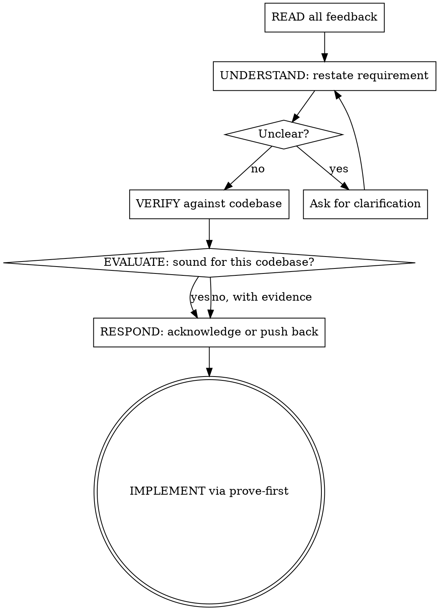

# Receive Feedback

Evaluate code review feedback through technical verification, not social performance. Every suggestion gets checked against codebase reality before implementation. Disagreement backed by evidence is more valuable than agreement backed by nothing.

<HARD-GATE>
Do NOT implement review feedback without verifying it against the codebase first. Performative agreement is forbidden. "You're right, implementing now" without checking the code is not a response -- it is a failure of technical discipline. Read the feedback, verify the claims, then act.
</HARD-GATE>

## Process Flow

## The Six Steps

1. **READ**: Read all feedback without reacting. Do not start implementing mid-read.
2. **UNDERSTAND**: Restate each requirement in your own words. If unclear, stop and ask before proceeding. Partial understanding produces wrong implementations.
3. **VERIFY**: Check the reviewer's claims against the codebase. Read the file. Run the code. Does the problem they describe actually exist?
4. **EVALUATE**: Is this suggestion technically sound for THIS codebase? Does it account for existing patterns, constraints, and dependencies?
5. **RESPOND**: Technical acknowledgment ("Fixed in src/parser.ts:42") or reasoned pushback with evidence. No filler.
6. **IMPLEMENT**: One item at a time. Each change goes through prove-first. Test each fix individually before moving to the next.

## Forbidden Responses

These indicate performative agreement, not technical verification:

- "You're absolutely right!" -- agreement without checking
- "Great point!" -- flattery, not analysis
- "Let me implement that now" -- before verifying the claim
- "Thanks for catching that" -- without confirming it is actually a bug

Instead: restate the technical requirement, verify it, then act or push back.

## Pushback Framework

When feedback is wrong, say so with evidence:

1. **State what the code actually does** -- cite the specific file:line
2. **Explain why the current approach was chosen** -- constraints, dependencies, prior decisions
3. **If the reviewer is right after verification** -- acknowledge and fix. No defensiveness.
4. **YAGNI check** -- does the suggestion fix a real problem or a hypothetical one? Grep the codebase for actual usage before adding "proper" handling for unused paths.

## Implementation Order

When feedback contains multiple items, triage by impact:

1. **Critical** -- blocks functionality, security vulnerability, data loss risk
2. **Simple** -- quick wins that reduce noise (typos, imports, naming)
3. **Complex** -- design changes, refactoring, architectural shifts

Address critical first, not comfortable first.

## Source-Specific Handling

### Human reviewer
- Higher weight -- they may have context you lack (business requirements, past incidents, team conventions)
- Still verify technical claims against the codebase
- If feedback conflicts with prior decisions, flag the conflict rather than silently choosing

### Agent reviewer
- Verify every claim independently -- agents hallucinate file paths, function signatures, and bug descriptions
- Check that referenced code actually exists and behaves as described
- Agent confidence level has no correlation with accuracy

## Anti-Patterns

**"Implementing everything without checking"**
Some suggestions are wrong. Some are based on misreading the code. Some fix problems that do not exist. Verify first.

**"Arguing with everything"**
Pushback requires evidence, not preference. "I don't like that approach" is not pushback. "This breaks the existing contract at api/handler.ts:87" is pushback.

**"Cherry-picking easy items"**
Addressing the typo fix while ignoring the security vulnerability is not progress. Critical items first, regardless of effort.

**"Batch-implementing without testing"**
Implement one item, test it, confirm it works, then move to the next. Batch changes hide which fix broke what.

## Evidence Requirements

- Each critical feedback item has been verified against the codebase
- Implemented changes pass tests (via prove-first)
- Pushback items include technical justification with file:line references
- No items left unaddressed without documented rationale

## Transition

When verified feedback requires code changes, implement via **prove-first**: write the failing test for the fix, then write the minimal code to pass it.
