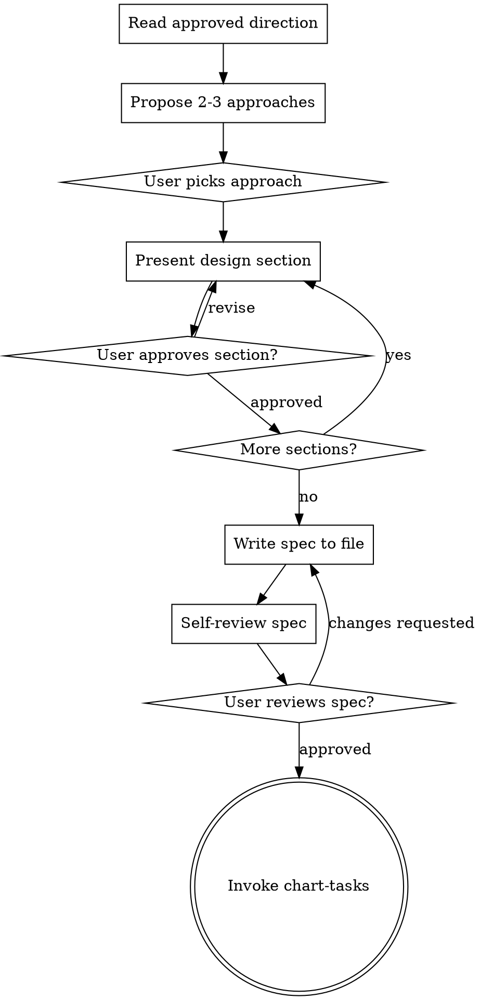

# Shape Design

Transform an approved direction into a concrete spec document covering architecture, data flow, edge cases, and error handling. Present the design in digestible sections, get user approval, write it to a file, self-review for gaps, then hand off to planning.

<HARD-GATE>
Do NOT invoke chart-tasks, write any implementation code, or create any plan until:
1. The spec document has been written to a file
2. You have self-reviewed it for placeholders, contradictions, and ambiguity
3. The user has reviewed and approved the written spec
All three conditions must be met. No shortcuts.
</HARD-GATE>

## Process Flow

## Checklist

1. **Review the approved direction** from discovery -- re-read the problem statement, approach, scope, and success criteria
2. **Propose 2-3 approaches** with trade-offs and your recommendation. Include:
   - Technical approach (what technology, patterns, architecture)
   - Pros and cons of each
   - Your recommendation and why
3. **Present design in sections** scaled to complexity. For each section:
   - Architecture and component breakdown
   - Data flow (inputs, transformations, outputs)
   - Edge cases and error handling
   - Integration points with existing code
   - Get user approval before moving to the next section
4. **Write spec document** to `docs/forge/specs/YYYY-MM-DD-<topic>-design.md`
5. **Self-review the spec** -- deploy the **spec-analyst** agent to review the written spec for completeness, contradictions, ambiguity, and scope. Fix any issues the analyst identifies before presenting to the user.
   - Placeholder text ("TBD", "TODO", incomplete sections)
   - Internal contradictions (does the architecture match the feature descriptions?)
   - Ambiguity (could any requirement be read two ways?)
   - Scope creep (is this still one focused deliverable?)
   - Fix any issues inline
6. **Ask user to review the written spec file** before proceeding

## Anti-Patterns

**"This is too simple to need a real design"**
Every piece of work gets a spec. For truly simple work, the spec can be 3 sentences. But it must be written, reviewed, and approved. Simple work is where unexamined assumptions hide.

**"Let me present the whole design at once"**
Large designs presented as a wall of text get rubber-stamped, not reviewed. Break it into sections. Each section gets explicit approval.

**"I'll fix the spec during implementation"**
The spec is the contract. If it needs changing, change it explicitly and get re-approval. Silently diverging from the spec during implementation is how scope creeps and requirements get lost.

## Evidence Requirements

- Spec file exists at the documented path
- Self-review completed (no TBD/TODO/placeholders remain)
- User has explicitly approved the spec file

## Transition

When the user approves the written spec, invoke **chart-tasks** to decompose it into an implementation plan.
