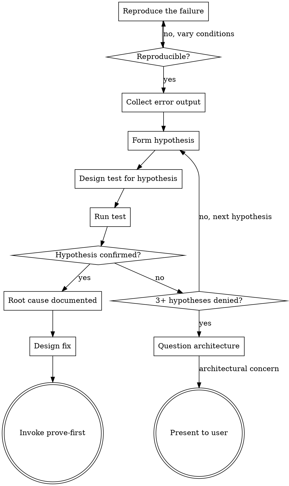

# Trace Fault

Systematically identify the root cause of a bug or unexpected behavior through hypothesis-driven investigation. Do not guess at fixes. Understand the failure first, then fix it with confidence.

<HARD-GATE>
Do NOT propose a fix until you can explain the root cause. "I think this might fix it" is not an investigation result. "The failure occurs because X calls Y with a null argument when Z is empty, as shown by this stack trace" is a root cause. Find the cause first, fix second.
</HARD-GATE>

## Process Flow



## Investigation Protocol

### Phase 1: Reproduce
- Run the failing test or reproduce the behavior
- Capture the exact error output (stack trace, log messages, return values)
- Note the conditions: what input, what state, what environment

### Phase 2: Hypothesize
- Based on the error, form up to 3 hypotheses about the root cause
- Rank by likelihood
- For each hypothesis, identify what evidence would confirm or deny it

### Phase 3: Test Hypotheses
- Start with the most likely hypothesis
- Add targeted logging, assertions, or test cases to confirm/deny
- If denied, move to the next hypothesis
- Track which hypotheses have been tested and their results

### Phase 4: Document and Fix
- Document the confirmed root cause
- Explain why the bug exists (not just what it is)
- Design a fix that addresses the root cause (not just the symptom)
- Write a regression test that fails without the fix and passes with it
- Implement the fix via prove-first discipline

## Hypothesis Tracking Format

```markdown
## Hypothesis Log

### H1: [Description]
**Likelihood**: High/Medium/Low
**Test**: [What to check]
**Result**: Confirmed/Denied/[pending]
**Evidence**: [Output or observation]

### H2: [Description]
...
```

## Anti-Patterns

**"Let me try changing this and see if it helps"**
Shotgun debugging. Each change introduces a new variable. Understand the failure, then make one targeted change.

**"The error message says X so the fix is obviously Y"**
Error messages describe symptoms, not causes. The null pointer exception is a symptom. The missing validation three layers up is the cause.

**"I fixed the test to pass"**
Fixing the test instead of the code means the bug is still there but the alarm is silenced. Unless the test was genuinely wrong, fix the code.

**"It works now, not sure why"**
If you cannot explain why the fix works, you have not found the root cause. You have found a coincidence. Investigate until you can explain the causal chain.

## Escalation

After 3 failed fix attempts on the same bug, STOP. The bug may be architectural. Ask:
- Is the abstraction wrong?
- Is the data model forcing a workaround?
- Is the coupling too tight?
- Does each fix reveal a new problem in a different place?

Present the architectural concern to the user before attempting a 4th fix. This is not giving up. This is recognizing that repeated symptom-level fixes on an architectural problem will never converge.

For advanced investigation techniques (defense-in-depth, condition-based-waiting, parallel investigation, architecture questioning), see `techniques.md`.

## Evidence Requirements

- Failure has been reproduced (output captured)
- At least one hypothesis tested
- Root cause identified and documented with evidence
- Regression test written that fails without the fix

## Transition

When the root cause is identified and a fix is designed, invoke **prove-first** to implement the fix with test-first discipline.
